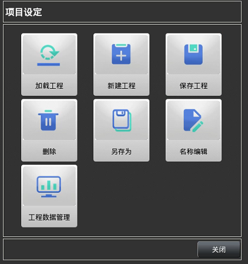
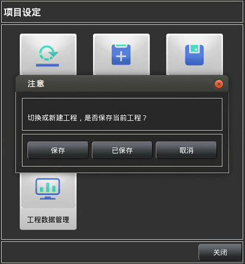
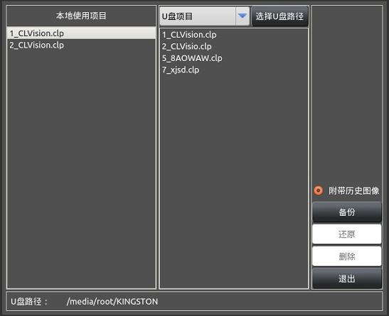

通过主界面`6`中的【工程】打开

主要用来操作工程配置文件（程序文件），其中灰色按钮为测试功能，待功能测试完后可以使用。

#### 加载工程
用于载入之前保存的工程。该工程文件需要对应放在/opt/.CLVision/projectfile目录下，才能被识别

#### 新建工程
创建一个新的工程，实现新的检测目的或对新的检测物进行检测。 需要对新的工程重新命名

#### 保存工程
保存当前配置的工程，保存成功后可以到/opt/.CLVision/projectfile目录下找到该工程文件以及历史图像数据

#### 删    除
选择后会有工程文件列表，可选择列表内无用的工程进行删除。该操作可以单独删除工程文件， 也可以删除工程中所保存的历史图像数据 

#### 另 存 为
将当前打开的工程另存为其他编号的工程文件，可用于对同一产品不同颜色进行多套工程及参数保存。

#### 名称编辑
可以更改当前工程的名称。

#### 工程数据管理
该功能可以将主机中的工程文件拷贝到U盘

点击该项会弹窗提示保存，若已经保存可以点击【已保存】跳过步骤，每次点击【保存】都会重新保存一遍.

1）设置第二栏中的【选择U盘路径】，浏览选择U盘路径
2）点击左侧第一栏【本地使用项目】中的项目
3）设置第三栏中的【是否附带历史图像】，点击【备份】

