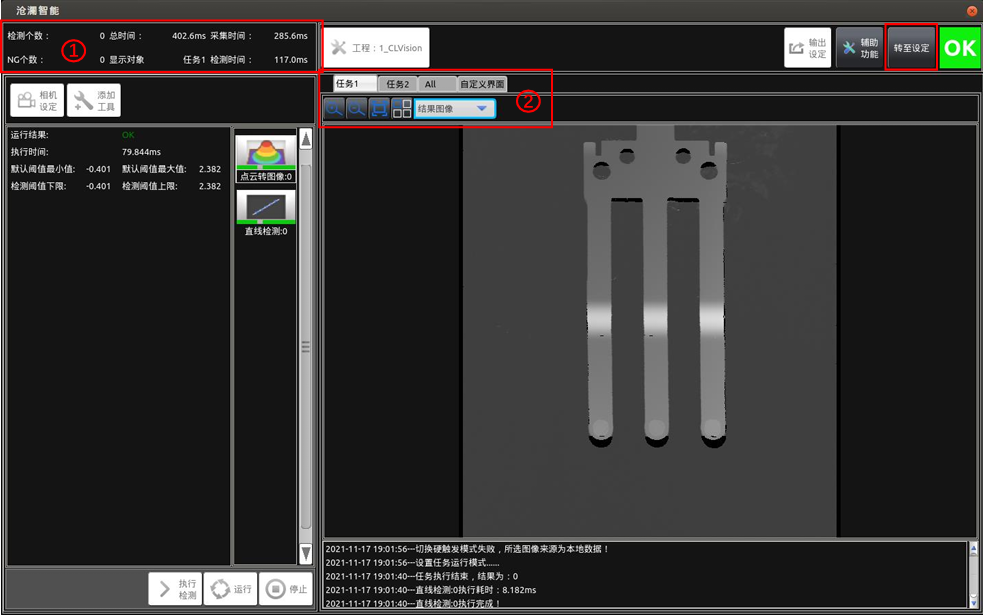

 
当点击【转至运行】后，此处按钮变为【转至设定】，点击后可以从运行模式回归到设定模式；  
并且转至运行后将不可以执行【添加任务】、【删除任务】以及图中变白部分，可以在辅助功能
进行通信的状态监视、远程协助以及录屏操作， 切换任务对不同任务不同工具进行切换查看当前
运行效果，也可以切换到自定义界面（详见：子界面-自定义界面）看配置的自定义显示内容。

从上图可以看出，以下为【转至运行】后改变的内容：  
1、 对应设定模式下的【1】增加了【检测个数】及【NG个数】  
检测个数：获取到图像并执行处理的次数。   
NG 个数：检测结果为不良品的个数。   
2、 对应设定模式下的【8】，减少了【设置】和【保存数据】，增加了【自定义界面】；
可以切换到自定义界面查看自定义显示内容（图像+数据）。详见：子界面-自定义界面