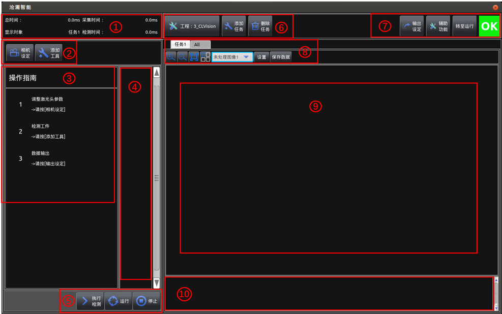
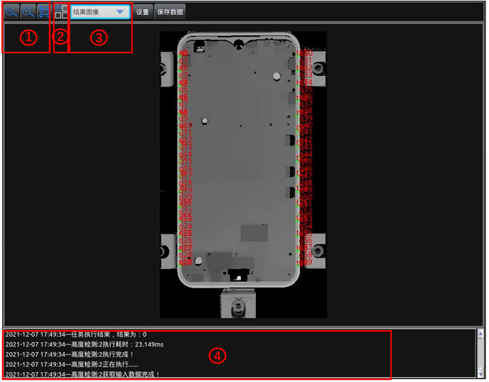
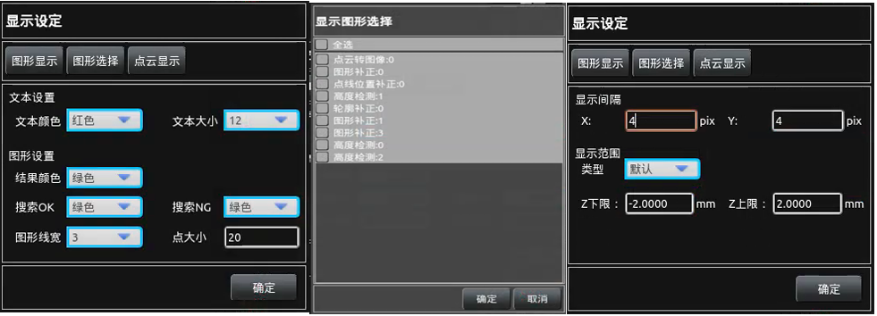
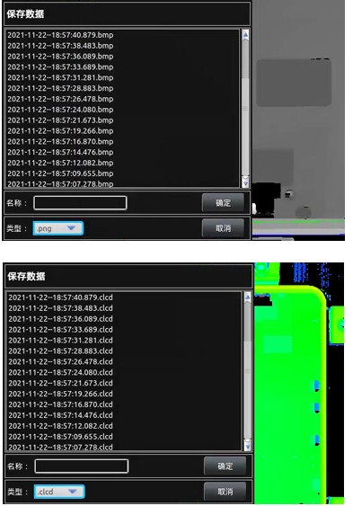

 
主要说明在各个操作界面显示图片/点云的窗口界面的操作内容，下图即为显
示窗口的内容

#### 1.图像的缩放

点击`+`放大视窗中的图像，点击`-`缩小视窗中的图像。使用鼠标滑轮同样可以达到此效果，并且按下鼠标右键可以对图片接进行拖动

#### 2.切换显示的视窗
用于切换单个处理视窗/结果视窗和多个处理视窗/结果视窗

#### 3.切换图像/点云显示
在不同的状态下存在`基准图像`, `未处理图像`， `未处理点云`， `结果图像`，可以切换显示

#### 4.软件运行日志
软件在执行过程的信息提示；

#### 5.设置
用于设置图形显示效果、点云显示效果及选择显示工具，通过这些可以设置显
示的框线颜色及粗细、文本颜色及大小，设置显示的点云区域及点云的密集程度等，主要用
于显示，不改变工具执行和判定效果。

1.图形显示：  
文本颜色/大小：用于设置显示窗口显示的文本内容的大小及颜色。   
结 果  颜  色：设置工具执行结果输出框线的颜色。   
搜 索  OK/NG：设置工具执行搜索框线的颜色，可分别设置工具执行OK和NG时的颜
色，便于工具执行时实时观察。   
图 形  线  宽：用于设置显示窗口所有框线的粗细程度。   
点   大    小：用于设置显示窗口交点等表示点的X的大小设置。   
2.图形选择：   
点击后会出现如上图中间栏所示窗口，在此处可以选择在显示窗口显示的对应工具的框线，可以
多选，选择感兴趣的检测工具，便于观察各工具执行情况，需要和显示窗口的工具栏中的   
搭配使用，奇数次点击切换到多工具检测框（和图形选择的具体选择工具有关）显示，偶
数次点击切换到当前所选工具的检测框显示。  

3.点云显示：  
显示间隔X/Y：将显示的点云数据按照设置的间隔数量进行取点，中间未取到的点不进行
显示。  
显示范围/Z上下限：当选择默认时，点云会将采集到的所有高度的点进行显示，如果选
择指定设置则需要配合Z上下限使用，点云会根据指定Z上下限的范围显示采集到的点
云，未在上下限之内的不进行显示。

#### 6.保存数据 
用于手动保存当前窗口显示的图像或点云，当显示图像时可以保存为.png或.bmp的
图像，当显示点云时可以保存为.ecd或.clcd的点云数据，可用于NG图像的重检，如下图所示

