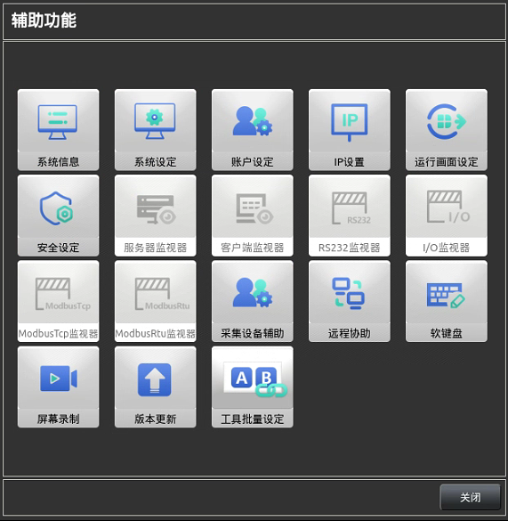
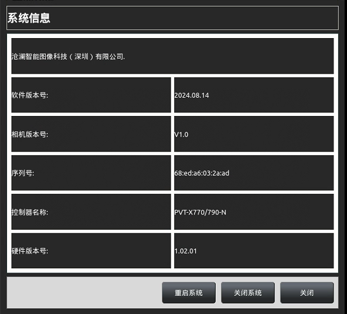
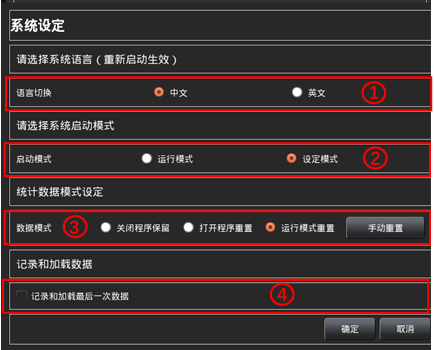
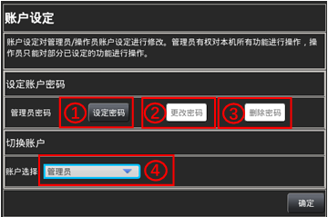
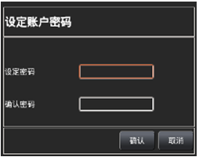
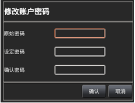
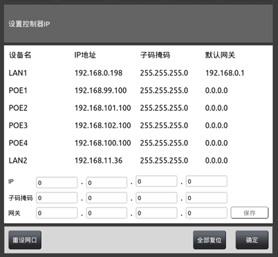
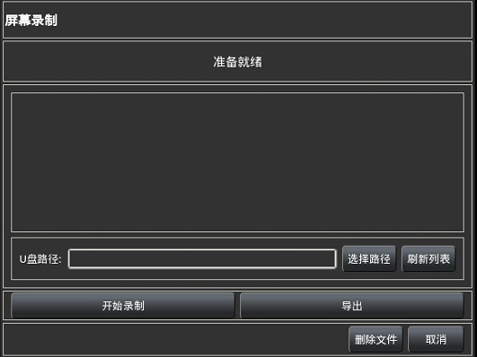

通过主界面`7`中的辅助功能打开

辅助功能主要包含系统使用设定、系统IP设定、通信/IO状态监视、远程协助以及屏
幕录制等功能，【统计分析】、【文件管理】、【软件升级】及【系统备份】功能还在测试，暂
时未开放，不能执行操作，此处仅对部分功能进行说明；不在此处说明的有【运行画面设定】
详见：5.1 自定义界面，【 I/O监视器】、【 RS232监视器】、【服务器监视器】及【客户端监视
器】详见：5.3.3.运行监视，下图所示为辅助功能界面。

#### 1、系统信息 
下图所示为系统信息界面内容，主要显示了当前机台的软件版本及硬件版本，此信息
用于后期出现问题时进行针对性查询。

重启系统：控制器的关机重启。  
关闭系统：将控制器关机。  
关    闭：关闭此界面。

#### 2、 系统设定 
主要用来设置软件运行的全局信息，下图为系统设定界面： 

1）.语言切换：设置软件运行语言，一旦设置会全面切换（功能在测试中，敬请期待）。  
2）.启动模式：此处用来设置软件启动时的运行模式，默认为【设定模式】，如果工程配置
成功，建议将此处更改为【运行模式】，请注意修改完成后应在【项目设定】中执行【保存
工程】。  
3）.数据模式：用每个任务中记录的检测数量、OK数量、NG数量这些数据在什么情况下
进行重置；【关闭程序保留】程序关掉再打开会按照之前的计数继续记录，【打开程序重置】
表示程序关闭再打开后会将这些数据清零并重新记录，【运行模式重置】表示每次切换到运
行模式时都会进行清零并重新记录。【手动重置】表示手动进行清零并重新记录。  
4）.记录和加载最后一次数据：（功能测试中，敬请期待）。 

#### 3、账户设定 
为防止人员误操作，导致设备执行异常，因此将使用账户分为两类，一类是开放设置权
限的【管理员】，一类是仅允许状态监视、执行以及停止执行的【操作员】，建议使用时加设
【管理员密码】；下图为账户设定界面： 

a.设定密码：用于设定当前【账号选择】处的账户密码，后期切换时需要输入正确的密
码才可以切换到相应的账户，点击此处后会弹出下图所示的窗口用于设置密码，【设定密
码】和【确认密码】输入一致后点击【确认】即可完成当前账户的密码设置，若不再设置
则点击【取消】。

b.更改密码：用于更改当前【账号选择】处的账户密码，操作步骤是在【原始密码】输
入当前账户之前的账户登陆密码，然后在【设定密码】处输入新密码，在【确认密码】处
输入与【设定密码】处相同的密码，如果【原始密码】处经验证确实为之前设置的密码，
则点击【确认】后即可将密码进行更改，若点击【取消】，则不进行修改。

c.删除密码：用于删除当前【账号选择】处设置的账户密码，只需要在【设定密码】
处输入当前选择账户目前设置的账户密码然后点击【确认】即可使当前账户不需要密码进
行切换登录，点击【取消】则不进行删除操作。

d.账户选择：可以选择当前登录账户为【管理员】或【操作员】，并且上述密码设置、
更改以及删除都是对应当前选择账户。

#### 4、IP 设置 
此处显示控制器各个网口的IP地址、子网掩码以及默认网关，其中LAN1、LAN2分别
对应控制器上标有 LAN1 和 LAN2 的位置，POE1……POE4 分别对应控制器上标有
POE_LAN3……POE_LAN6 的位置；在使用时需要先将激光头 IP 初始化设置为
192.168.100.xxx，192.168.101.xxx，192.168.102.xxx 或 192.168.103.xxx 段下的 IP（与控制器
IP 同段但不完全一致，即192.168.100.xxx标绿色处与控制器对应IP端口相同，标红色处
与控制器相应端口不同，范围是000-255）。

#### 5、远程协助 
可查看我司的 沧澜智能——通过手机进行远程操作说明SOP(1) 文档进行操作。

#### 6、屏幕录制 
该功能可以实现录制视频，主要是方便客户在后期培训之后，为避免客户忘记如何操作，
可以进行录制操作视频给客户看，加深记忆；点击屏幕录制后会出现如下画面；显示准备就
绪表示可以开始执行新的录制。

开始录制：点击开始录制会出现图二所示变化则说明已经开始录制，可以点击【取消】
将此界面隐藏，将需要录制的动作按步骤操作一遍；录制完成后点击【停止】即可完成
当前的录制。 
取    消：点击取消可以将此界面隐藏-此时仍在在执行录制。
导出到U盘：可以插入U盘选择U盘路径将当前的录屏导出到U盘。

