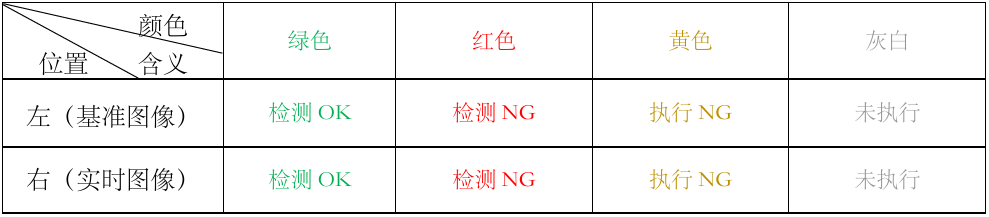
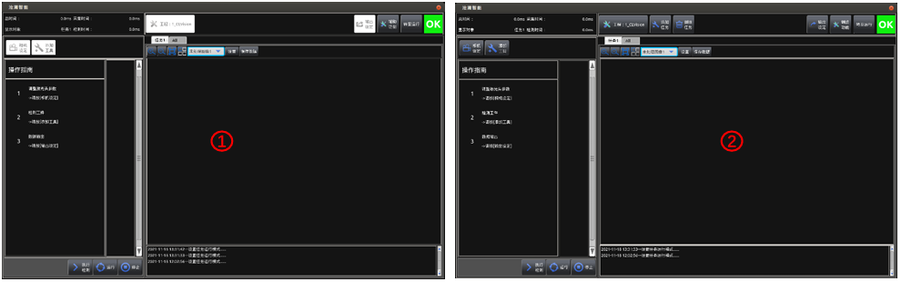

## 设定界面-管理员账户
 
 下图为空白工程下的设定模式，此时默认账户设定为管理员： 

 

#### 1、处理时间的实时显示 
总 时 间：从采集图像到数据输出执行单次所使用的时间。  
采集时间：激光头采集图像所使用时间。   
检测时间：得到图像后执行工具检测所使用的时间。   
显示对象：当前显示的任务操作对象。 

#### 2、相机设定及添加工具
相机设定：用于设置【工作模式】及【基准数据】，如果选择连接的激光头，可对激光头
进行位置调整及使用参数设置，详见：功能模块1-相机设定。   
添加工具：用于配置检测项目所需要使用的检测工具，详见：功能模块2-添加工具。 

#### 3、操作提示 & 单个工具结果数据显示窗口
初始时未添加任务或添加新任务时此窗口首先会显示图示的【操作指南】 
添加工具后会显示当前所选工具的执行数据。

#### 4、用于显示添加的工具列表
右键单击所选工具可对其进行【编辑】、【删除】、【复制】、
【粘贴】（仅选择某个工具执行[复制]后可操作）、【重命名】及【移动】，
其中每个工具会有两个图中红框所示的[状态指示条]，具体表示含义如下表所示：

#### 5、执行工具及停止工具的操作
执行检测：单次进行采图、工具检测、结果输出的操作。   
运    行：重复进行采图、工具检测、结果输出的操作；若是运行时点击了其他操作则会在执行完当前执行循环后自动退出此模式。   
停    止：在运行时点击此处可安全退出设定下的运行模式。 

#### 6、工程任务管理
工    程：显示当前加载的工程名，点击此处可对工程文档进行操作，如【加载工程】、【新建工程】、【保存工程】、【删除】及【另存为】，详见：子界面-项目设定。   
添加任务：软件初始打开时会默认存在一个任务，点击此处可以添加另外执行任务连接
相同（功能测试中）或不同的激光头执行不同的检测内容；最多可支持四个任务，超出四个不允许添加。 
删除任务：用于删除不需要的任务（错误创建或后期减少检测内容），如果当前选中了其
中某个任务，则会删除当前选中任务，并弹窗提示进行确认，如果选中了【All】，则会删
除选中【All】之前选择的任务，同样会有弹窗提醒。 

#### 7、运行-输出以及辅助功能设定
输出设定：用于设置工程的【判定设定】、【通信设定】、【数据记录】及【图像保存】功能的
详细设置，详见：功能模块3-输出显示。   
辅助功能：用于使用此软件的一些辅助工具；如【远程协助】、通信状态监视、自定义界面 
的添加、账户设定以及安全设定等，此处分两处进行详细讲解，分别详见：子界面-辅助功
能界面及功能模块5-输出显示。   
转至运行：设定完成后可点击此处开始自动运行，如果没有手动保存工程，则点击运行
时弹出的是否执行保存建议选择执行，防止更改了某些设置却没有保存。   
OK：此处是【综合判定】的状态指示，如果综合判定为OK,则此处显示绿色且为OK，
如果综合判定为NG或检测出错，则此处显示红色且为NG。 

#### 8、图像视窗调整及各类设置 

：用于选择当前查看的任务选项，【All】中包含当前创建的所有任务窗格。  
：用于对当前窗口图像显示进行放大、缩小和自适应填充整个窗口。   
：用于切换单个处理框/结果框（线）和多个处理框/结果框（线）。   
：用于切换当前选择工具的显示图像，可以是【未处理图像】、【未处理点云】
及【结果图像】等内容，方便查看处理效果。   
设置：用于进行图像、点云及检测结果的显示效果的设置；详见：子界面-设置。  
保存数据：用于保存当前窗口显示图像的保存，如果是图像则可以选择保存为“.bmp” 
和“.png”，如果是点云则可以选择保存为“.clcd”或“.ecd”文件，其保存路径为当前
软件根目录下的【Datas】文件夹下；详见:子界面-保存数据

#### 9、图像显示窗口
至于显示图像内容，则由第8条说明进行操作。 

#### 10、运行信息显示
可以提示配置检测工具的执行信息，如由问题方便追溯，另外可以保存日志文件方便后期查阅。 

## 设定界面-操作员账户

设定模式下可以通过辅助功能进行【账户设定】，详见：子界面-账户设定，在
管理员和操作员账户下有不同的操作权限， 如下图所示：

示图左边为操作员账户下的设定界面，右边为管理员账户下的设定界面；因此在操作员
模式下主显示界面不允许执行【相机设定】、【添加工具】、【项目设定】、【添加任务】、【删除
任务】及【输出设定】等操作。
