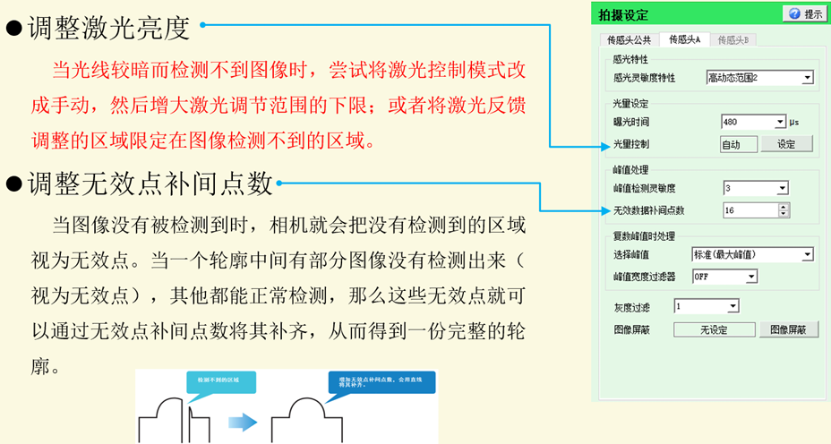

#### 4.2.激光头安装初使用 
将激光头按照【参考距离】安装接线完成后就可以进行基础的连接及高度调整等工作了，这
里做简单介绍： 
a. 相  机 连 接：未使用的激光头控制器的初始连接IP为192.168.10.XXX，需要将其
IP 设置为与视觉控制器同段下的 IP，（视觉控制器 POE1-POE4 网口的 IP 分别为
192.168.100.100、192.168.101.100、192.168.102.100、192.168.103.100）同段的意思是设
置激光头IP前三段数字与其中一个网口IP相同，最后一段数字设置在0-255之内，
但不得与网口IP相同，即不得是标红的数字；详见：附录1：激光头IP初始化更
改步骤。  
1、 安装高度调整：将激光头调整到最佳检测高度，详见：附录 2：激光头安装高度调整。  
2、 倾斜补正调整：将安装激光头时的手动安装产生的倾斜进行补偿，详见：附录3：激光
头安装倾斜矫正。  

#### 4.3.数据参数 
此处用于设置激光头采集图像的光量程度、曝光时间及采样灵敏度等与采集图像/点云
效果有关的参数，可根据此处设置优化采集到的点云数据，结合【数据参数】及【高级配置】
中【拍摄设定】进行说明，可设置的参数如下图所示。

感  光  灵 敏 度：【高精度】因动态范围较小，适用于反射率差较小的对象物体，【高
动态1-4】表示采集时长短曝光比例按照 1->4 的顺序更改设定，可以应对具有更大反射差
率的对象物体，根据采集产品数据点的实际效果进行设置。  
曝  光   时   间：设定拍摄元件的最长曝光时间，根据图像效果和采样周期设置。最
长曝光时间受已经设定的采样频率（最快速触发周期）的限制。  
光  亮   控   制：设定亮度的调整范围，该范围由激光光量和曝光时间的组合决定；
【自动】表示使用系统默认光量，【手动】表示自行设置调节范围的控制范围的上限值和下
限值，可在“1 ～ 99”范围内设定。  
峰  值  灵 敏 度：设定从图像数据转换为轮廓数据时，检测各X坐标的峰值的“检测
难易度”。从1～5中选择“峰值检测难易度”（选择5时最容易检测到峰值（灵敏度高）、选
择1时最难检测到峰值（灵敏度低））。  
无效数据补间点数：无效数据，是指因光量过多或者不足而被视为无法检测出的轮廓数
据。无效数据补间点数在“0～16”范围内设定。轮廓内，当两段有效数据间的无效数据个
数小于补间点数时，无效数据将被置换为直线补间数据。  
选  择   峰   值：是指同一X坐标上存在多个峰值时，从下述项目中选择采用哪个 
峰值；【标准】：最大的峰值，【NEAR】：最近端(传感头近端)的峰值，【FAR】： 最远端(传感
头远端)的峰值，【使之转为无效数据】：同一X坐标有多个峰值时，作为无效数据处理。 
峰值 宽度 过滤器：与对象物体原有的反射光相比，受环境光和多重反射光影响，感光
峰值的形状有变粗的倾向。利用这种现象，将宽度较粗的峰值视为“可疑峰值”而不执行
检测处理，称为[峰值宽度过滤器]。用于设定是否执行该过滤器处理(设定范围为OFF，1～
10，值越小过滤的效果越明显)。

#### 4.4.触发参数 
此处主要用于设置激光头拍摄触发的配置参数，结合【触发参数】及【高级配置】中的
触发设定进行说明，可设置的参数如下所示。 

触 发 模式：触发模式可选择【连续触发】、【外部触发】或【编码器触发】，设为【连续触
发】时，自动连续激活触发，持续执行采样，不受理IO触发输入。选择［编码器触发］时
受理输入至编码器信号输入端子的脉冲信号（增量式编码器输出的信号）作为触发，并且应
设定合适的［编码器类型］和［触发间隔］，选择编码器触发应结合视觉软件的【通信触发】；
选择【外部触发】则通过IO输入端子输入触发，在任意时刻激活触发就执行采样，此处应
结合视觉软件的【外部硬触发】进行使用。  
编码器类型：反馈编码器信号的输出类型，有【差分】和【单端】两项，可询问电气人员输
出方式。  
输 入 模式：可选择【1相1递增】、【2相1递增】、【2相2递增】及【2相4递增】，【1相
1 递增】表示取反馈脉冲的A相信号的上升沿为触发脉冲，【2相1递增】表示取反馈脉冲
的A相信号的上升沿或下降沿作为触发脉冲，【2相2递增】表示取反馈脉冲的A相信号的
上升沿及下降沿为触发脉冲，【2相4递增】表示取反馈脉冲的A\B相信号的上升沿及下降
沿均作为触发采集的脉冲信号，需要根据驱动器反馈脉冲的实际情况进行选择。 
细 化 点数：设置每次间隔多少个编码器脉冲信号后激活触发。例：当编码器一个脉冲信号
为 0.001mm，细化点数设置为 5 时触发间隔为：5*0.001mm=0.005mm，即运动方向间隔为
0.005mm,每隔 0.005mm 后采集一行数据。  
采 样 频率：如果触发模式为连续触发，会根据此处设定的周期激活触发；如果触发模式为
编码器触发或外部触发，则此处设定的周期为能够支持的最快触发速度。需要注意的是7000
系列的激光头当Z方向测量范围为【FULL】时，采样频率最大可设置2500，此时Z轴高度
为激光头参数中的Z轴高度，当Z方向测量范围为【MIDDLE】时，采样频率最大可设置
4500，此时Z轴高度为激光头参数中Z轴高度的1/2，当Z方向测量范围为【SMALL】时，
采样频率最大可设置8000此时Z轴高度为激光头参数中Z轴高度的1/4。（Z方向测量范
围的设置位置在【高级设置】中的拍摄设定内，如下图所示） 

批处理测量：选择ON或OFF，ON为开启批处理，OFF关闭批处理。开启批处理进行测
量，会采样“批处理点数”指定的轮廓数后再停止。  
批处理点数：设定1次测量进行处理的轮廓数量，范围50-15000，需要结合产品长度及细化
点数进行设置；采集图像长度= 细化点数 * 批处理点数/ 1000，（单位mm）。  
Y  间  隔：设置取Y方向的数据点时，每一列数据点间的间隔，一般设置为与【X数据间
隔】一致。 

#### 4.5.查看编码器触发脉冲个数 
当【触发方式】设置为【编码器触发】时，如果怀疑没有接收到正常的脉冲信号可以查
看下图所示的【编码器值】，查看与所设置的是否一致，进入方式：【相机设定】->【高级配
置】->【实时设定】->【端子】。

