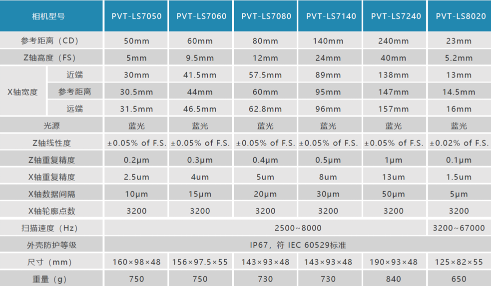

使用激光头需要在选型时进行正确的选型，使用时进行正确的参数配置，以下是
在项目中激光头型号选择需要注意的参数以及使用时根据使用场景需要配置的激光头参数

### 激光头选型参数说明 

类似2D相机镜头选型中需要注意的物距、焦距以及视野等，在3D激光头的选型中也
需要根据项目场景选择合适的激光头，下面对选型时需要注意的参数进行如下说明：  
**参考距离（CD）**： 表示激光头的安装高度（距离被测物上表面），在此安装高度下进行采集
才可以采集到有效数据，选型时也需要根据现场情况查看是否满足所选型号的安装高度，
此数据用作安装参考数据，后续使用高度还需要进行细调，详见：  
**Z 轴高度（FS）**：此数据表示可以检测的产品厚度，只有厚度之内的产品才可以采集到数据。  
**X  轴  宽  度**：此数据表示可以采集的产品宽度，产品长度是由设置参数中的批处理点数
确定的；因激光是类似三角形式散发出去的，所以在有效的采集高度内，距离激光头越近扫
描的宽度越小，距离激光头越远扫描的宽度越大。  
**Z  轴重复精度**：Z方向上同一产品反复多次采集时的重复采集精度。  
**X  轴重复精度**：X方向上同一产品反复多次采集时的重复采集精度。  
**X  轴数据间隔**：表示X方向上每两个采样点之间的间距，即X方向采样。  
**X  轴轮廓点数**：X方向上采集点的最大数量。  
**扫  描 速  度**：即采样频率，表示每秒可以扫描到的脉冲数量；取其倒数表示扫描一次使
用的时间，用此参数可以评估最短的检测周期，需要注意的是：采样频率在2500以内时Z
方向扫描范围为给出的完整范围，采样频率大于2500小于等于4500时Z方向扫描范围为
给出范围的1/2，采样频率大于4500小于等于8000时Z方向扫描范围为给出范围的1/4，
需要考量满足检测周期的情况下是否满足测量高度。  
当然除此之外也需要注意一下安装尺寸，确保在给定的空间下可以安装激光头

