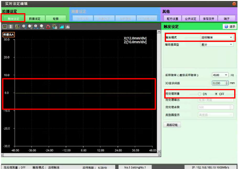

### 1.相机调试器设置
a.需要将【触发模式】设置为【连续触发】
b.将【批处理测量】设置为【OFF】

### 2.观察和调整
**观察**此时如果激光头安装高度在测量高度范围内则会出现红框中所示的一段直线 
a.首先确定出现的那段直线是否是因为采集产品产生的 
b.其次如果该直线不在0.0标线处则需要移动激光头高度 
**调整**使其在0.0标线处。 
步骤:相机设定->高级配置->实时设定->触发设定 
注意:可在此处观察扫面直线确定激光头是否在产品中间，从而设置拍摄时激光头轴所在位置。 
也可以将扫描的直线调整到0.0偏上或者偏下处，根据产品位置、测量高度及激光头Z轴量程进行调整。 

