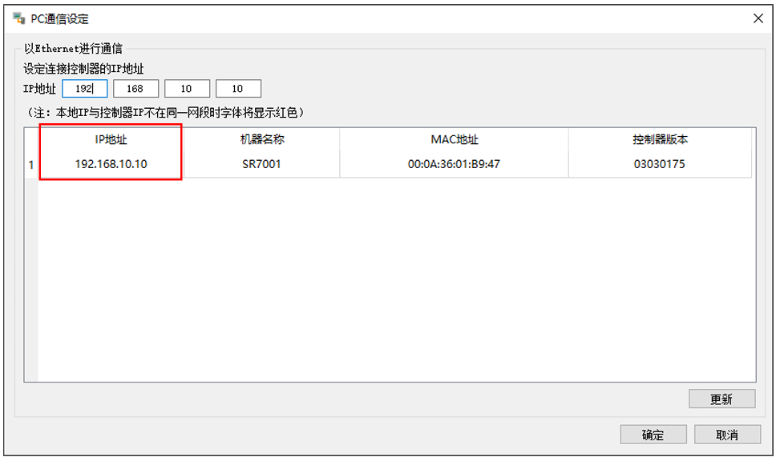
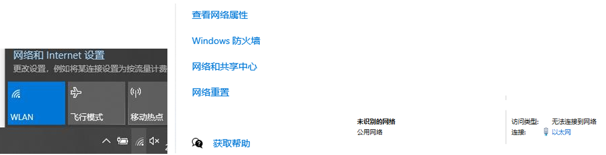
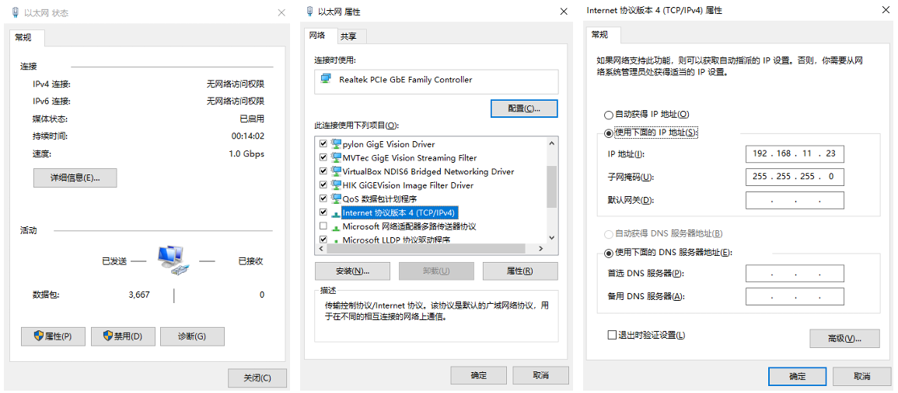
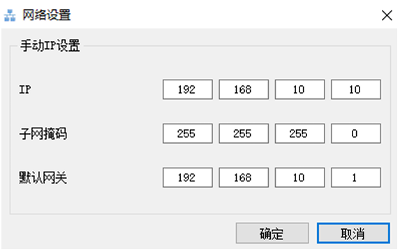

激光头初始未设置时的IP为192.168.10.xxx，需要将其 IP 设置为与连接端口IP同段的
IP 才可以正常使用，此设置仅需设置一次，建议发货前设置好。

### 1.查看IP
查看当前连接激光头IP，如果使用笔记本的 windows 系统需要安装打开
【EdgeImaging】软件，如果连接不上会出现下图所示界面，其中IP地址即表示当前连接的
IP 地址；如果使用出货机器直接连接需要运行“/opt/.CLVision/tools”路径下的
【EdgeImagingLinux】,无法连接时均会出现下图所示界面显示当前将激光头IP。

### 2.设置采集器端口IP
将与激光头采集控制器相连接的网络端口先设置为与激光头采集器同段的IP，
如上所示，将连接端口IP改为“192.168.10.xxx”， xxx可以设置从0-255之间除去与激光
头IP相同的任意数字。  
如果是windows 系统需要进入到【网络和Internet 设置】中，然后选择【网络和共
享中心】，查找到连接的以太网，如下图所示：

鼠标左键点击然后选择【属性】，然后选择【协议版本4】，鼠标双击进入进行网口IP设
置，将IP设置为同段的IP即可。

如果使用出货机器，需要运行视觉软件，在【辅助功能】的【IP设置】中将相应的端口
IP 更改掉即可，执行完此步骤激光头和修改设备已经可以连接。 
### 3.设置激光头IP
将激光头 IP 设置为 192.168.100.xxx 或 192.168.101.xxx 或 192.168.102.xxx 或
192.168.103.xxx 四个 POE 网口的默认IP，然后将激光头IP进行更改，步骤如下，连接激光
头控制软件【EdgeImagingLinux】，正常进行连接之后会出现如图所示的显示。  
然后选择【工具】的【网络设置】会出现以下画面，将 IP,子网掩码及默认网关进行相
应设置即可。 

