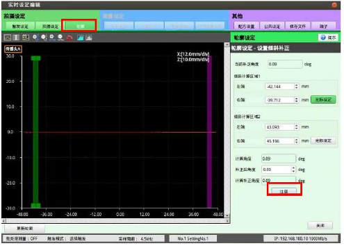

### 1.承接高度调节设置
保持高度调节时的设置。

### 2.设置
a.切换到【轮廓】的【传感头公共】 
b.将【设置倾斜补正】勾选上 
c.然后点击其后的【设定】

进入到图示界面，将中绿色和紫色框分别拖到完整直线的两端点击注册，然后关闭即可 
**步骤**:相机设定->高级配置->实时设定->轮廓 
**注意**:因激光头需要拍摄两侧的产品，因此矫正完其中一侧后应将激光头移动到另一侧查看直线是否有倾斜，
若有倾斜，则或许需要调整一下治具台面 
倾斜矫正最好在执行采图前进行调整，保证数据一致。

