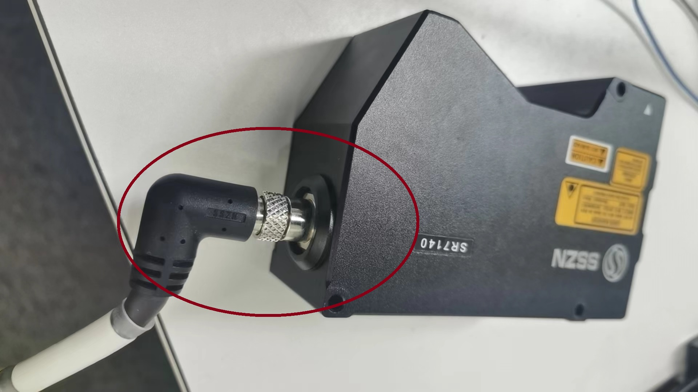

当下有两种类型的相机连接方式：
A. 一种含有采集器，相机通过采集器中转然后再连接到终端的工控主机上，相机上只有一根线。 
B. 另一种不含采集器，相机直接连接到终端的工控主机上，相机有两根线。 
下面详细说明：

## A类相机的接线方式

### 1.包含的器件

如下图所示：

### 2.接线说明

a. 首先,一头接好相机的线，另一头接到采集器的`红色圆圈处`

b.然后，将对应的网线一头接到采集器的另一个接口（网口，下图中采集器的`红色圆圈处`） 
另一头接到工控机的靠近端子的那一个网口（下图中工控机中的`红色圆圈`处）

c. 编码器的四条线（A+, A- ,B+ ,B-）一头连接在运动控制系统的电机上， 另一头连接在下图采集器的`红色圆圈处`

d. 两根电源线（0V， 24V）接到电机上或者其他对应的供电器上。

## B类相机的接线方式

### 1.包含的器件

如下图所示：

### 2.接线说明

a. 对应的网线(较细的那一条)一头连接相机的网口，另一头连接到工控机靠近端子的那一个网口（下图中工控机中的`红色圆圈`处）

b.对应信号线另一端连接到运动控制系统 
需要分出来连接编码器的四根信号线（A+, A- ,B+ ,B-）以及两根电源线（0V， 24V）

另外会有对应的视频教程，请联系相关人员获取。

