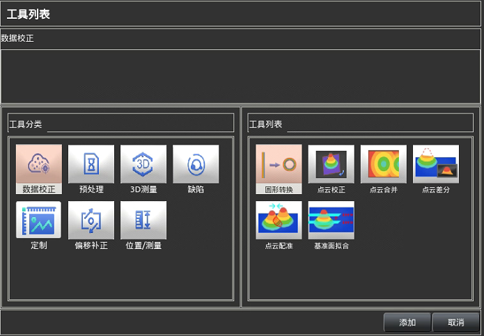
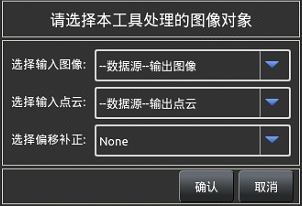
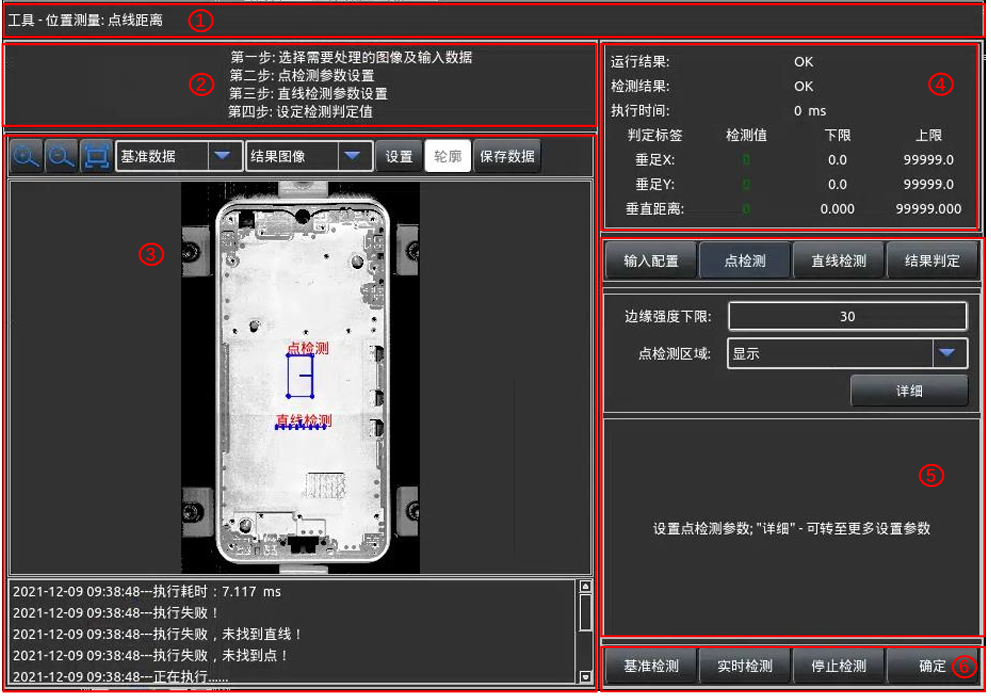

在主界面上`2`处点击【添加工具】打开

 
此章节主要介绍软件控制器系统检测工具的具体使用方法；点击添加工具后会出现下图
所示的工具列表，预处理包含点云转图像及将要添加的滤波处理等，偏移补正包含对图像
位置的补正工具，尽量保证实时检测图像与基准图像位置相同，从而保证各个检测点不会
有较大偏移，位置/测量主要是找边缘线，弧形圆及线间距等的2D工具，3D测量包含3D
的平面度、高度差及段差的测量。   
选择需要的工具点击添加便可添加相应工具到工程内，需要对工程进行参数配置，以达
到最优的检测效果。

#### 1.工具相同元素 
每个工具的作用都是不同的，但是在添加工具时会有一些相同的显示内容，这里简单说
明，不再每个工具逐个说明。 

#### 1.1.选择输入数据 
点击添加相应的工具后，会有一个可以选择工具输入的窗口弹出，对应不同的工具会出
现不同的选择输入内容，整体上有选择输入图像、输入点云、输入点、输入直线、输入偏移
补正、输入基准面以及输入区域等输入对象，根据工具配置内容选择相应的输入即可，进入
工具后也可在工具内进行修改，需要注意的是点击取消仍然会创建选择的工具。下图所示
为点云转图像工具的输入选择弹窗。 

#### 1.2.工具配置界面 
工具参数的配置界面的布局是相同的，这里主要对各个布局的内容说明一下。

1. **标  题  栏**：用于显示当前配置的工具分类及工具名称。  
2. **提  示  栏**：用于显示工具界面内的操作内容及参数配置的提示（含参数配置作用及参
数配置范围）。   
3. **显示 窗 口**：用于显示工具内的基准图像、输入图像、检测结果图像以及工具执行信息
提示等内容。  
4. **检测结果栏**：用于显示工具执行结果、判定结果以及结果数据等，可在配置完成后点击
【执行操作栏】中的基准检测（对基准图像的检测）或实时检测（若选择激光头则需要
激光头重新抓取一张图像，选择本地数据则会按照本地数据列表读取下一张图片进行检
测）观察工具执行效果，满足要求则工具配置OK。   
5. **参数配置栏**：此处用于配置工具的输入数据、检测参数以及当前工具的判定条件；后面
每个工具说明是将主要说明每个工具的这个部分。    
6. **执行操作栏**：此处可分别执行对基准图像、实时抓取（读取）图像的检测与停止检测，
点击确定则表示工具配置完成，会返回到软件主界面。 

