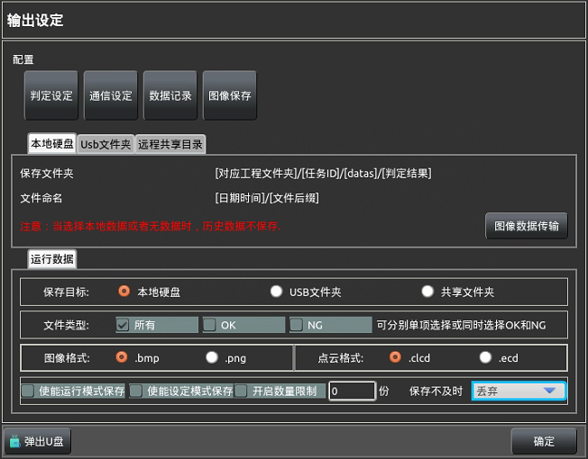

在主界面上`7`处点击【输出设定】打开

 
#### 1.判定设定 
软件运行有两种判定方式，方式一：综合判定，单个工程内所有任务中的所有工具执行
及判定的并集，方式二：部分判定又称工具判定，这种方式允许自己选择需要进行判定的工
具或决定检测结果的工具的判定结果的交集或并集。选择部分判定会有下图所示。

添    加：添加一个部分判定组，添加之后点击【设定】可以选择判定组内要判定的工
具内容，【条件】中【OR】表示所有【设定】的工具判定结果中只要有一个OK，判定组便
OK；【 AND】表示只有所有【设定】的工具都OK，判定组才OK；点击【设定】会进入下
图二设置处，选择需要的判定工具添加即可，如下图所示： 

删    除：删除当前所选判定组。  
删除全部：删除所有添加的判定组。

#### 2.数据记录 
用于设定需要保存到本地的实时生产数据内容，并且设定数据保存的一些保存设置，所
保存的文件以日期进行命名，保存的文件放置在软件根目录下的“/log/”文件夹下。

保 存 流 水  日 志：选择是否保存工程执行中的执行信息。  
自动清理日志和数据：设定是否自动清理保存的日志和数据，为保证内存建议勾选。  
保   存    天   数：设定保存数据文件的最大保存天数。
运行/设定 模式保存：选择在哪种模式下进行数据及日志的保存，可以同时选择设定模式
和运行模式。  
选   择    数   据：用于选择保存的数据，如果有已经选择的数据所对应的工具被删除
了。则应该移除相应的工具，下图所示为选择工具的操作界面，添加方式同通信设定中选
择数据的方式基本上是一致的。  
保   存    No.    ：用于对选择出的数据进行一键全选和取消全选，便捷操作。

#### 3.图像保存 
此处用于设定保存图像的一些设定，选择保存的文件类型及文件格式等，如下图所示；
图中红色文字提示当【相机设定】中的数据来源选择本地数据时将不执行保存。

保   存    目     标：设定图像文件保存的路径，目前仅可支持添加到本机硬盘，文件保存的路径
即为上图所示【本地硬盘】的路径。  
文   件    类     型：可以选择将工具检测的OK产品数据或NG产品数据或采集到的所有产品数
据进行保存。  
图像 / 点云   格  式：选择保存的图像及点云数据的格式。  
使能设定/运行模式保存：设定在什么模式下可以保存图像。  
开  启 数  量  限  制：设定最多可保存的图像数量，根据硬盘大小进行设置。   
保  存   不   及   时：如果保存图像未完成时接收到下次触发信号时选择放弃单次保存还是等待保
存成功再执行下次检测。