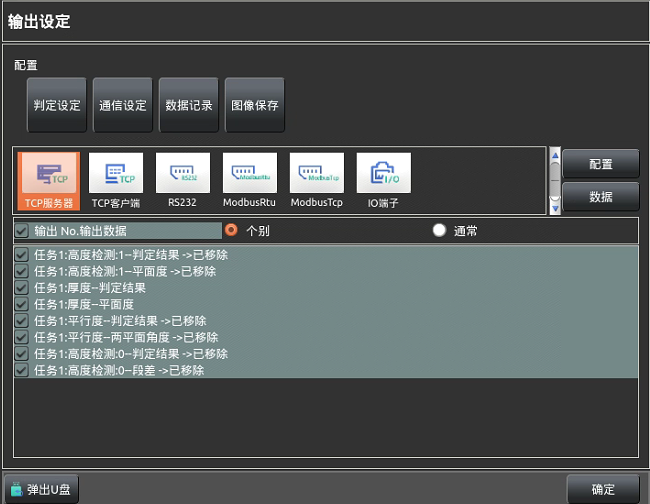

在主界面上`7`处点击【输出设定】-->【通信设定】打开

 
选择【通信设定】会进入到下图所示界面，目前可以选择的通信方式有下图所示无协
议的TCP服务器/客户端、无协议RS232及IO通信，其中【个别】表示综合判定结果为
执行任务的判定结果的并集，【通常】表示综合判定结果为所有任务判定结果的交集。（注
意：通信设定在打开且没有手动关闭的情况下切换工程同样不会关掉且如果两工程通信设
定内容不同建议加载完工程后关掉软件重新启动一下。） 

## 通信配置 
设定所选通讯方式的端口配置，TCP通信方式有IP设置、端口号设置及结束符设置，
RS232 有串口、波特率等的设置，IO有端口的打开或关闭及输出口的默认状态设置。 
#### 1、TCP服务器 
当前通信方式为无协议的通信方式，标示1处为客户端发送到服务器的接收信息，标示
2 处为服务器发送到客户端到的信息。

IP   地   址：其他设备与本设备网线连接端口的端口IP，本机IP可在【辅助功
能】->【IP设置】查看。  
端        口：可随意设置，让客户端的端口号与服务器保持一致即可。   
连 接 列  表：显示已连接到本及TCP服务器的客户端设备IP及端口号。   
结   束   符：发送数据时单条数据数据末尾自动添加的符号作为单条数据结尾标 
志，可根据客户端要求进行设置。  
打开  /  关闭：开启TCP服务器或关闭TCP服务器。  
清空输入/输出：这两个按钮分别用来清除两处接收的信息和发送的字符信息。  
发         送：单次给已连接的客户端发送标示2处内容。  
确         定：使用当前服务器配置并退出。

#### 2、TCP客户端 
同TCP服务器一致，此处TCP客户端同样是无协议的通信方式，且中间两栏分别为服
务器发送信息的接收栏和客户端发送数据的数据栏。

IP   地   址：此处应输入其他作为服务器设备端的连接端口IP，本机连接端口的IP
地址应与服务器端端口IP在同一段内（即举例：192.168.100.XXX最后三位XXX可以
不同，其他需要相同）。  
端        口：与所连接的服务器端口保持一致。  
结   束   符：发送数据时单条数据数据末尾自动添加的符号作为单条数据结尾标
志，可根据客户端要求进行设置。  
打开  /  关闭：开启TCP客户端或关闭TCP客户端。  
清空输入/输出：这两个按钮分别用来清除两处接收的信息和发送的字符信息。  
发         送：单次给已连接的所连接服务器发送内容。  
确         定：使用当前服务器配置并退出。 

#### 3、 RS232 
该通信方式为无协议的232通信，设置时与其他设备端的波特率、奇偶校验、数据位、
停止位及控制流设定一致即可，结束符和相连设备RS端沟通使用。

#### 4、IO 
IO 通信即表示使用设备的IO端口，需要需要使用，则需要先在配置处将端口打开，然
后选择输出端口的默认状态，并且在此处还可以手动进行输出，可用于测试与其他设备端
IO 连接的是否正确。IO

关闭/打开：选择是否使用IO端口。  
手动 调试：勾选后可以点击右侧端使相应端口进行电平转换。  
高  /  低：用于配置默认状态下相应端口是否输出（也即电平状态）。 
确     定：使用更改配置并退出。

#### 5、 Modbus RTU 
此通信方式即使用modbus通讯协议的串口通信方式，串口可以是232和485，在使用时需要
确定视觉设备与其他通信设备的主站和从站，并确定串口通信需要设置的波特率以及从站站号。

串    口：选择连接的串口。   
波 特 率：与连接端一致，波特率越大数据传输速度越快，本系统支持最大波特率为19200。   
奇偶校验：数据的校验方式，与连接端一致即可。  
数 据 位：单串数据的数据位数，与连接端一致即可。   
停 止 位：数据结束的标志，与连接端一致即可。   
站    号：主站时表示要连接的从站的站号，0时表示已广播形式发送；从站时表示本设备的站号。   
执行模式：可以选择主站或者从站的方式。   
超时时间：超出时间，数据包会被丢失。   
Float 类型：此处设置仅用作手动通讯测试，当发送数据为浮点型时进行数据的编码结构。   
读取配置：设置本设备实时读取相连设备的寄存器位置等。   
连    接：配置完成后可进行连接   
读/写地址：手动测试通讯时读写的地址。   
读/写数量：手动测试通讯时读写的数量。   
写入数据：手动测试时写入的数据。   
清空显示：情况通讯刷新的数据信息列表。   
确    定：设定完成之后退出。   
当设备作为从站时需要配置使用的寄存器或者线圈的地址，如下图界面所示：

图中所示的起始地址到终止地址即为与主设备通信使用的“合法”地址，超出地址范围的不能与本设备进
行数据交互，否则会报错。   
读取配置：   
如下图所示，本设备需要读取的参数在点击【读取配置】之后会进入到此界面，在此界面可以配置
连续地址的数据读取或者非连续的多数据读取。

添    加：添加新的读取内容。   
返    回：返回到连接配置界面，如果已连接，可查看读取的信息是否有异常。   
删    除：删除被选择的添加的读取内容。   
删除全部：删除所有添加的读取内容。  
站    号：和配置处一致。   
读取方式：与连接端沟通，可读取线圈和寄存器。   
起始地址：读取数据的首地址。   
读取数量：读取的数据数量。   
隐    藏：隐藏读取内容配置界面。   
配置地址内容：显示读取内容配置界面。   
地    址：当前数据的地址。   
数据选择：当前地址需要读取的数据内容，该数据名称为本设备使用数据的数据含义，含【写入确认】、
【相机触发】、【 禁止触发】、【 复位】、【 试运行】以及【切换程序】。 

#### 6、 Modbus TCP 
此通信方式即使用Modbus通讯协议的网口通信方式，在使用时需要确定视觉设备与其他通信
设备的主站（客户端）和从站（服务器端），并确定网口的IP以及端口号。   
此处的设置除了需要设置IP及端口号，其他的使用方式与【Modbus RTU】是一致的，作为服
务器时IP应设置为本设备进行连接网口的网口IP，作为客户端的时候IP应设置为连接设备的IP，
端口号与连接设备一致即可。 

## 通信数据处理 
设定所选通信方式发送数据的格式，IO处则表示根据哪些数据执行哪个端口的输出。 
#### 1、TCP及232 
此处是用来选择通信的数据内容，TCP服务器、TCP客户端及RS232都是相同的设
置，将它们放在一起进行说明。

数据类型：标示1处为数据类型选择，【检测值】即为每个任务中各个工具的数据内容，【判
定值】为综合判定结果、每个任务判定结果及配置的部分判定的判定结果，【变量值】为每
个任务的检测次数、OK/NG次数（率）及检测时间数据。   
任务列表：标示2处在数据类型选择【检测值】及【变量值】时表示的是已经添加的任务列
表，选择【判定值】时表示判定内容列表。   
数据内容：发送的具体数据内容的选择。   
添    加：将选择的数据内容加入到通信数据输出上。   
删除全部：删除所有已经添加的数据。   
删    除：删除当前选择的添加的数据，   
上/下 移：将添加的数据发送的前后顺序进行调换。   
数据头/尾：所设置数据的数据起始/末尾添加内容，空则不添加。   
分 隔 符：本数据和下个数据表示分隔的字符。   
命令反馈及反馈输出：选择命令反馈即表示收到通信触发信号时（工程内容还未执行）自动
输出给另一端设备的字符串，字符串内容为反馈数据后输入框的内容。   
执行或数据异常输出：配置当所选数据的工具执行异常时使用什么字符串进行内容输出。   
工具不执行输出：配置在工具不执行时是否进行输出以及输出什么内容。   
数据保留小数点位数：设定发送数据中数字数据保留的小数点位数，   
判定值同时包含执行工具和不执行工具：如果某个判定组配置的数据中的工具既有执行OK的也有执行NG的，
配置这两种情况下数据的输出。  

#### 2、IO 
此处是用来配置IO端口输出的条件及时间，其中13、14号端口可以选择分别作为切换
工程时切换完成和切换成功的信号，其他的端口可根据需要进行设置。 

输出端子：OUT0-OUT14分别对应的为IO端口的DO0-DO14。   
输 出 项：在此配置IO的输出条件，选择【无】表示所配置端口不进行输出，选择【综合
判定】表示通过工程的综合判定结果进行输出，使用【部分判定】选择已设置的判定组的判
定结果进行输出，选择【任务 X-STO】表示所设置任务执行完成时进行相应端口的输出，
选择【工具判定】类似与配置部分判定组内容。

输出条件：可以选择在所选条件为OK或NG时执行输出。   
输出方式：可以选择【每次更新输出】或【单击输出】，每次更新输出表示工程执行单次进
行端口输出刷新，单击输出表示工程单次执行完后依据【单击时间】按照时长执行相应端口
的输出。   
单击时间：在【输出方式】选择【单击输出】时有效，设定单次更新输出时长。