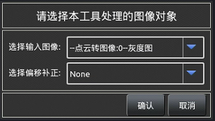
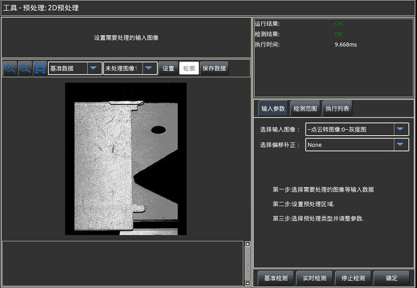
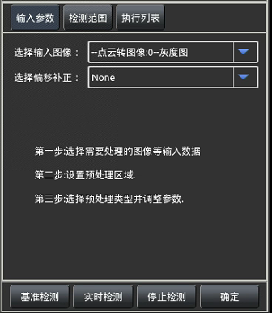
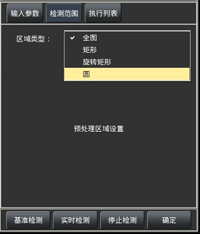
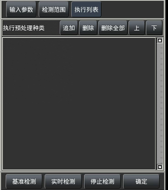
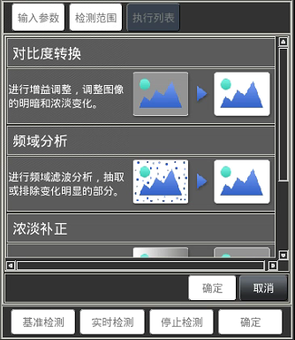
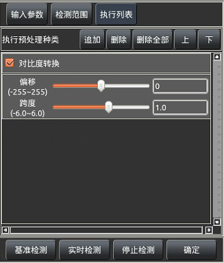

此工具用于对输入图像或者点云转图像之后的图像进行预处理操作，使产品图片突出符
合用途的特征，消除干扰，为后续的缺陷工具提供明晰的处理图像。

### 1.输入参数 
如下图所示，此选项卡用于选择待处理的输入图像和补正
源，如果在进入此工具前选择了相应的输入则可以不再进行此设
置，若需要更换输入数据则可在此进行其他数据的选择（前置工
具有相应类型的输出）。  
**选择输入图像**：选择进行预处理的输入图像。   
**选择偏移补正**：选择当前图像进行偏移的补正源。

### 2 检测范围 
如下图所示，此选项卡用于选择输入图像中需要进行预处理的区域，
可以选择进行全图处理，执行时间会较长，如果只需要对产品某个确定部
分进行检测，可使用圆、矩形或者旋转矩形选择相应的区域，区域越小的
时候在相同预处理方法下执行时间越短。结合实际检测需求进行设置。

### 3 执行列表 
如下图所示，此选项卡用于选择添加对图像进行预处理的方法。各按
钮操作说明如下：  
**追    加**：添加对图片执行预处理的方法，如右图所示。  
**删    除**：删除已添加的预处理列表中被选中的预处理项。  
**删除全部**：将已添加的所有预处理项全部删除。  
**上  / 下**：将添加的预处理列表中被选中的预处理项进行上移或
下移，工具会按照排列顺序决定预处理执行的顺序。 
本系统目前提供三种预处理方法： 
#### 1. 对比度转换 
用于调整图像的明暗和浓淡变化的倾斜，可增强图像明暗
的对比度。  
**偏移**：偏移增加时图像变亮，减少时图像变暗；  
**跨度**：跨度增加时对比度增强，减少时对比度减弱； 
#### 2. 频域分析
图像的频率是表征图像中灰度变化剧烈程度的指标，是灰度在平面空间上的梯度，低
频（灰度缓慢变化）代表图像整体轮廓，高频（灰度急速变化）代表了图像噪声，中
频（灰度变化处于低高频中间）代表图像边缘、纹理等细节。  
**类型**：可以选择使用带通（正弦）滤波或者高斯滤波，具
体使用效果可根据具体产品进行调试。 
*a. 带通滤波* 
**频 域 阈值**：正弦滤波器的高度值，即过滤图像频率的
正弦曲线的参数值，被过滤的区域灰度值为0，值越低，高频变化轮廓越宽，值越
高，高频轮廓越窄。  
**图像金字塔**：进行频域分析的图像层级，层级越大保留的原图细节越少，但可相应
增加处理速度，可结合实际情况进行使用。  
*b. 高斯滤波*
**Sigma**  :此参数也可理解为“标准差”或者“半径”，此
参数较小时保留高频部分，此参数逐渐增大时会逐渐保留
较多中低频部分。  
**敏 感 度**：图像灰度增加倍数，-1-1表示缩小，大于0时
表示高频增加亮度较高区域，小于0时表示增加亮度较低
区域。  
**排除干扰**：图像灰度增加数值，负值则表示减小。  
**图像金字塔**：进行频域分析的图像层级，层级越大保留的原图细节越少，但可相应
增加处理速度，可结合实际情况进行使用。 

##### 3. 浓淡补正 
用于排除背景渐进的浓淡变化，只抽取对比度急剧变化的部分。  
**补正方法**：设定排除背景浓淡渐变的方，如下所述：

*a. 平 均 值补正*：以检测范围内的平均浓度值作为基准，计
算其与当前图像的差后补正图像； 
*b. 中 间 值补正*：以检测范围内的浓度的中间值作为基准，
计算其与当前图像的差后补正图像；  
*c. 实时浓淡补正*：以处理速度为优先的“阴影补正”；  
*d. 阴 影  补 正*：根据抽取大小从当前图像生成基准阴影图
像，计算其与当前图像的差后补正图像； 
抽取大小：仅在“补正方法”设置为“阴影补正”、“高速阴
影补正”时有效。设定要抽取缺陷的大小。该值必须为4的倍
数。抽取大小越小，对更细的阴影的处理效果越好，但处理时间
变长；  
**方    向**：仅在“补正方法”设置为“阴影补正”、“高速阴影补正”时有效。设定
“实时浓淡补正”的处理方向(X、Y、XY)； 

**明暗抽取**：选择要作为缺陷抽取的颜色，如下所示：  
*a. 明*  ：只抽取比背景亮的缺陷。  
*b. 暗*  ：只抽取比背景暗的缺陷。  
*c. 明暗*：用于抽取明、暗两种缺陷。  
*敏 感 度*：对补正后的图像设定增益。如果要提高对比度，请设定更大值；  
*排除干扰*：排除指定值或以下的干扰成分； 

