此工具用于对输入点云的高度信息进行滤波处理，通过【点云均值滤波】、【点云中值滤
波】以及【点云高斯滤波】可使输出的点云更加平稳，降低波动点或者离散点对后续检测的
影响；通过【滤除点云离散点】可以根据采集图像的离散点的特征对离散点进行相应的滤
除，提高后续检测的数据稳定性。

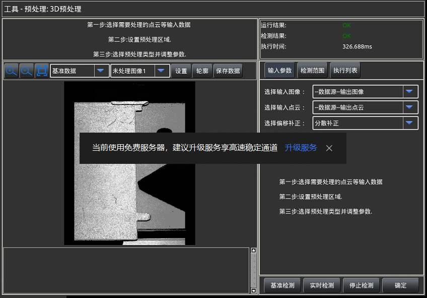

## 1 输入参数 
如图所示，此选项卡用于选择待处理的输入图像、输入点云
以及补正源，如果在进入此工具前选择了相应的输入则可以不再
进行此设置，若需要更换输入数据则可在此进行其他数据的选择
（前置工具有相应类型的输出）。 
选择输入图像：选择进行和点云一致的图像，用于放置进行3D预处理的处理范围。  
**选择输入点云**：选择进行预处理的输入点云数据。   
**选择偏移补正**：选择当前图像进行偏移的补正源。 

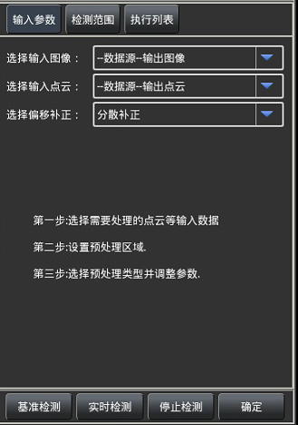

## 2 检测范围 
如图所示，此选项卡用于选择输入点云中需要进行预处理的区
域，区域的选择在和点云对应的图像上（此图像由输入图像确定），可
以选择进行全图（单次扫描的整个点云）处理，执行时间会较长，如果
只需要对产品某个确定部分进行检测，可使用圆、矩形或者旋转矩形选
择相应的区域，区域越小的时候在相同预处理方法下执行时间越短。结
合实际检测需求进行设置。 

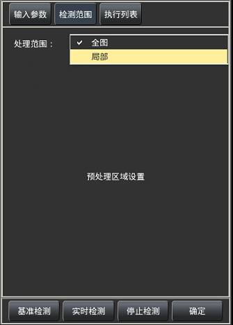

## 3 执行列表 
如图所示，此选项卡用于选择添加对点云进行预处理的方法。各按钮
操作说明如下：   
**追    加**：添加对点云执行预处理的方法，如右图所示。   
**删    除**：删除已添加的预处理列表中被选中的预处理项。   
**删除全部**：将已添加的所有预处理项全部删除。   
**上  / 下**：将添加的预处理列表中被选中的预处理项进行上移
或下移，工具会按照排列顺序决定预处理执行的顺序。   

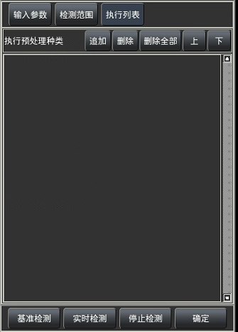
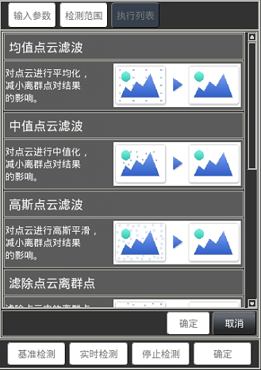

本系统目前提供四种预处理方法： 
### a. 均值点云滤波 
按照【掩码大小】以点云每个点为中心划范围遍历进行求和平均，
将计算出的均值替代为中心点的高度值，用于对点云平滑，降低波
动点及离群点的干扰。   
**掩码大小**：遍历处理区域点时以遍历到的点为中心向四周选择点
生成正方形的横纵向点的个数；5*5比3*3参与计算的点的个数多，
处理时间会变长，相对应的平滑效果会更好一点。   
**间    隔**：所生成正方形计算区域中相邻两个点间隔的点个数；可以在同等时间下以更大覆盖面进
行均值滤波，不过会忽略临近点高度值的变化，根据使用效果进行设置。   
**迭代次数**：执行遍历计算的次数，每次遍历都会在上一次遍历新生成的高度值上进行计算，可以更
有效的平滑，也会使执行时间过长。   

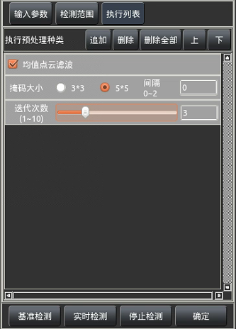

### b. 中值点云滤波 
按照【掩码大小】以点云每个点为中心划范围遍历求取范围内高度
的中值，将计算出的中值替代为中心点的高度值，用于对点云平滑，
降低波动点及离群点的干扰。   
**间    隔**：所生成正方形计算区域中相邻两个点间隔的点个数；可以在同等时间下以更大覆盖面进行中值滤波，不过会忽略临近点高度值的变化，根据使用效果进行
设置。   
**迭代次数**：执行遍历计算的次数，每次遍历都会在上一次遍历新生成的高度值上进行计算，可以更
有效的平滑，也会使执行时间过长。   

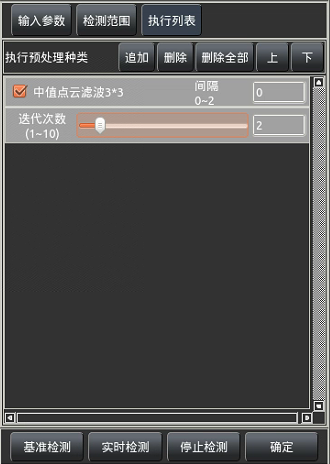

### c. 高斯点云滤波 
按照【掩码大小】以点云每个点为中心划范围遍历进行加权求和平
均，因距离中心点越近的值更能表示中心点的高度值，因此距离越
近的点在计算中会有更高的参与计算的权重，将计算出的均值替代
为中心点的高度值，用于对点云平滑，降低波动点及离群点的干扰。   
**掩码大小**：遍历处理区域点时以遍历到的点为中心向四周选择点   
**间    隔**： 生成正方形的横纵向点的个数；5*5比3*3参与计算的点的个数多，处理时间会变长，相对应的平滑
效果会更好一点。   
**迭代次数**：执行遍历计算的次数，每次遍历都会在上一次遍历新生成的高度值上进行计算，可以更
有效的平滑，也会使执行时间过长。   

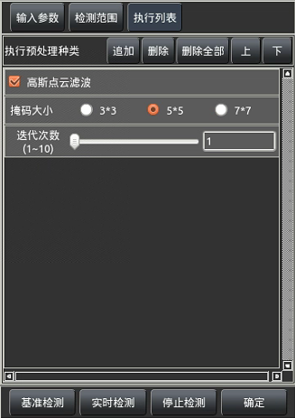

### d. 滤除点云离散点 
按照【掩码大小】以点云每个点为中心划范围遍历进行范围内除中心
点外所有点到中心点的相对高度值，如果相对高度小于等于【高度阈
值】的点的个数大于等于【数量阈值】，则认为此中心点为正常点，
反之则认为此中心点为离散点，会将其设置为无效值。   
**掩码大小**：遍历处理区域点时以遍历到的点为中心向四周选择点生
成正方形的横纵向点的个数；5*5比3*3参与计算的点的个数多，处
理时间会变长，也可以处理更大空间上的离散点。   
**间    隔**：所生成正方形计算区域中相邻两个点间隔的点个数；可以在同等时间下以更大覆盖面进
行离散点滤除，不过会忽略临近点高度值的变化，根据使用效果进行设置。  
**高度阈值**：与中心点的相对高度大于此参数的为单点计算的无效点，反之则为有效点，会对有效点
进行计数。  
**数量阈值**：此参数用于与有效点的个数进行对比，如果有效点个数小于此参数，则判定当前计算的
中心点为离群点，会将其设定为无效高度进行滤除，反之则为非离群点，用于参与后续的计算。  
**迭代次数**：执行遍历计算的次数，每次遍历都会用上一次遍历出的非离群点进行计算，可以更有效
的进行离群点的滤除，也会使执行时间过长；根据具体情况进行设置。

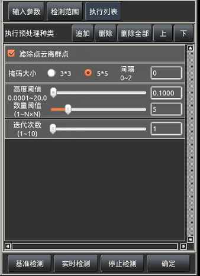

### e. 高度补偿

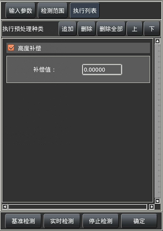

### f. 相对基准面滤除

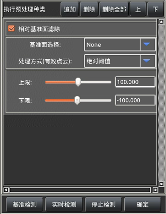
