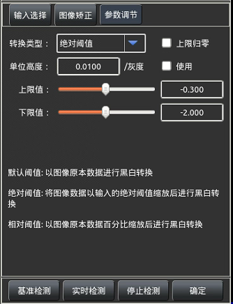

此工具是为了将采集到的点云数据按照配置的参数将高度数据转化为亮度信息，通过此
工具可以得到合适的亮度处理图像，可将原本得到的高亮度图或低亮度图按照后续使用需
求转换为合适的亮度图（图像中越亮的地方高度越高，越暗的地方高度越低，最暗的区域表
示高度已超出采集激光头Z方向采集范围）。

#### 1.输入选择 
如下图所示，此选项卡用于选择待处理的输入图像和输入
点云数据，如果在进入此工具前选择了相应的输入则可以不     
再进行此设置，若需要更换输入数据则可在此进行其他数据
的选择（前置工具有相应类型的输出）。

#### 2.图像矫正
分为全局图像矫正和局部图像矫正

矫正方法可以选择1.不使用矫正，2.使用高度补偿法， 3.使用基准面法（需引入平面数据）

#### 2.输入参数 
如下图所示，可在此处选择不同的转换类型进行转换，
分别是默认阈值、绝对阈值及相对阈值。 
**默认阈值**：根据采集到的图像的最高点和最低点做转换；
将最高点设置为图像亮度最高，最低点设置为亮度最低做
转换。  
**绝对阈值**：设置点的绝对高度分别作为最亮和最暗之处，
超出绝对阈值上限值的均为最大亮度，低于绝对阈值下限
值的均为最低亮度。  
**相对阈值**：将采集产品的高度数据按照百分比均匀化，高
度最低到高度最高分别对应的是采集的最低点和最高点，转化的方法是将相对阈值时的下
限比例及比下限比例低的点作为最低亮度，将相对阈值的上限比例及比上限比例高的点最
为做高亮度做转换。 

